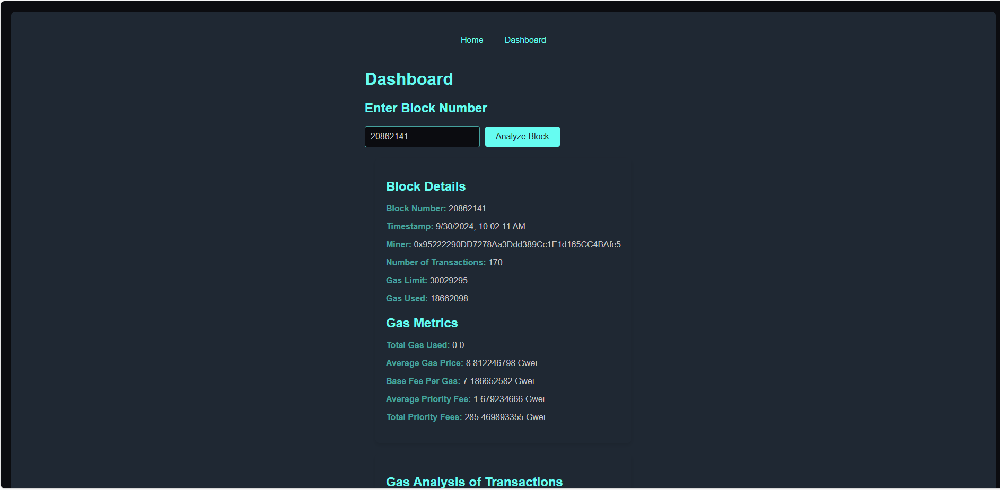
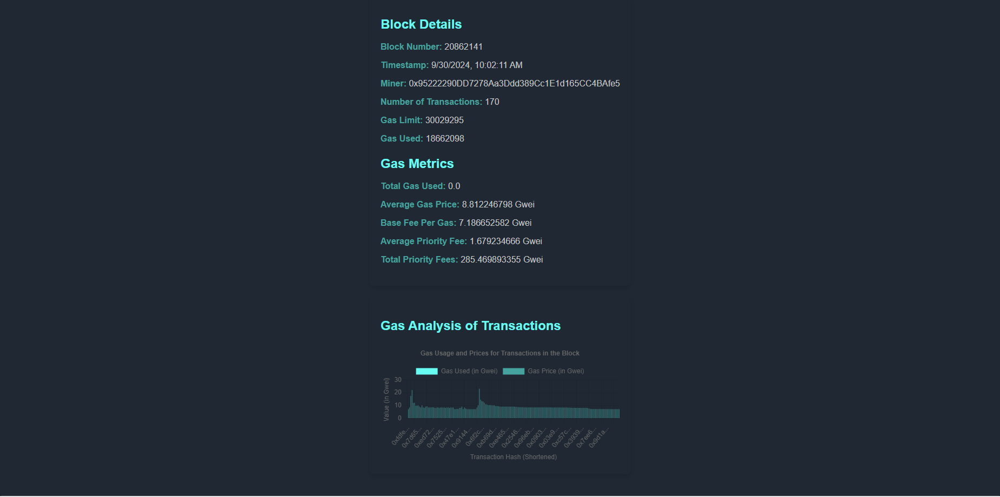

# 🚀 ArbGenie Block Explorer DApp

**ArbGenie** is a cutting-edge decentralized application (DApp) for analyzing Ethereum blocks, tracking gas usage, and providing detailed transaction insights. This full-stack project includes a **Node.js** backend and a **React** frontend, offering users a powerful yet intuitive interface for exploring the Ethereum blockchain.

## 🌟 Key Features

✨ **Block Analysis**  
Users can input Ethereum block numbers to fetch and view detailed data, including:
- 📊 **Gas Metrics**: Average gas price, base fee, and priority fees per block.
- 🧑‍💼 **Top Gas Spenders**: Display addresses that spent the most gas in a block.
- 🔍 **Transaction Details**: Explore individual transactions, including sender, receiver, gas used, and more.

✨ **Real-Time Data**  
- **Responsive** and interactive design ensures a smooth user experience across all devices.  
- Real-time updates and gas analytics for precise blockchain insights.

## 🛠️ Technologies Used

### Frontend
- **React**: Dynamic UI components.
- **React Router**: Seamless page navigation.
- **Chart.js**: Visualize gas usage and transaction metrics.

### Backend
- **Node.js**: API server to communicate with Ethereum blockchain.
- **Express**: Lightweight framework for routing and middleware.
- **Ethers.js**: Fetch and interact with Ethereum blockchain data.

### Development Environment
- **Hardhat**: Ethereum development environment for local testing and smart contract interactions.

### Dashboard View

### Gas Analytics

